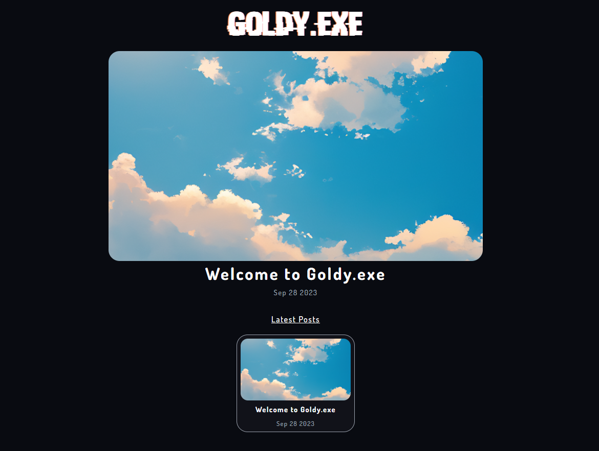

  # Goldy.exe

  Frontend for my blog website.

  

> [!Warning]
> Goldy-exe has now been merged with my [main website](https://github.com/THEGOLDENPRO/devgoldy.xyz), therefore this codebase is now deprecated.

This is the front end of my own custom blog site. It was built with [FastAPI](https://fastapi.tiangolo.com/), [Jinja2](https://palletsprojects.com/p/jinja/), [TailwindCSS](https://tailwindcss.com/) and [MongoDB](https://www.mongodb.com/).

> You can read more about it at https://devgoldy.xyz/blogs/post/0
